# NASA Missions Exploratory Analysis

## Executive Summary
The goal of a human mission to travel through cosmic space has long proven elusive. On July 20, 1969, humanity was able to reach space and approach the nearest object - the moon – thanks to strong competition between countries. It was a huge step forward for our species. An international effort fueled by a united goal with unwavering support from the public contributed to this achievement. This tendency will continue, and the money spent on research, construction, and sending humans to space will continue to rise. This milestone serves as a showcase for all the accomplishments achieved over recent decades by many countries, as well as a few high-level missions that changed how we think about outer space and the potential challenges we could face once we become a space faring civilization (As we are currently at 0.72 on the Kardashev scale). This project is an attempt to show some interesting insights from all the data NASA and other space agencies gathered over the years. There is a lot of information that may be inferred form the data which includes the mission data, astronaut data most of which was confidential until recently due to security issues.

## Ambition
Space missions are always highly ambitious. The amount of planning and research that’s done to achieve a single flight is something not many know of. For some perspective here are some statistics to get a general sense of the scale of these missions without which we wouldn’t know the following:
Do You Know?
- Sunsets on Mars are blue.
- The Apollo astronaut’s footprint on the moon could last up to 100 million years (Provided we keep it that way. Looking at you NASA - ARTEMIS!)
- A year on Venus is shorter than a day there.
- The center of milky way has tens of thousands of black holes.
- There are probably more than 1,000,000,000,000,000,000,000,000 (1 septillion) stars in the universe.
- If two pieces of the same metal touch in space, they will fuse together.
- There are more stars in the universe than there are grains of sand on Earth.
- It takes about 230 million years for our solar system to orbit the milky way.
- All the stars, galaxies and planets only make up about 4% of the universe.

## Research Questions
The following goes over the questions that we would like answered about the data and the approach that was used which includes the data cleansing procedures and pre-processing that was done. We will also go through all the attributes that we chose from the dataset and any other variables that we added to make the analysis more wholesome to gain greater insights. There are three two of queries we would like to know:
- Astronaut’s achievements ranging from the longest mission to the longest hours spent in flight etc.
- Astronaut background by gender and the most time spent on a single role.
- Mission and country specific achievements like which country has the most missions etc.

## Methodology
Dataset can be found here: [Astronaut Data](Data/)

After data cleansing, I was left with two tables. The first table consists of Mission info and the second table consists of Astronaut info. The primary key used is Personal ID to combine those tables in Tableau. The Mission table consists of 1276 rows, each row indicating a mission. There are 564 Astronauts who have successfully escaped Earth's gravity and have assisted with new discoveries, colonization, and equipment repair, among other things.
- Mission_info – Table containing information about the mission related features
	1. Id – Unique Id of each mission
	2. Personal_Id – Primary key for linking the Mission table with Astronaut table
	3. Selection – Code base for selecting the candidate for a mission
	4. Mission number – Number for each mission by the astronaut
	5. Occupation – Role of the person in that journey
Year_of_mission – Year in which the mission started
	6. Mission_title – Official name of the mission
	7. Ascend_shuttle – Shuttle used to ascend for each mission
	8. In_orbit – Type of orbit used to rotate around the earth for gaining momentum
	9. Descend_shuttle – Vehicle pod used to return back on earth
	10. Hours_mission – Number of hours spent for the mission
- Astronaut_info – Table containing Personal information of the Astronauts
	1. Personal_ID – Primary Key used to join the tables
	2. Name – Name used by media and defense
	3. Original_name – Birth name of the Astronaut
	4. Sex – Gender of the person
	5. Year_of_bith – Born date of the person
	6. Nationality – Primary citizenship of the astronaut
	7. Military_civilian – Binary indicator of civilian server or military server
	8. Total_number_of_mission – Total number of journeys done by the person
	9. Year_of_selection – Date on which the person is joined in the team
	10. Total_hrs_sum – Total number of hours spent in space
	
## Analysis
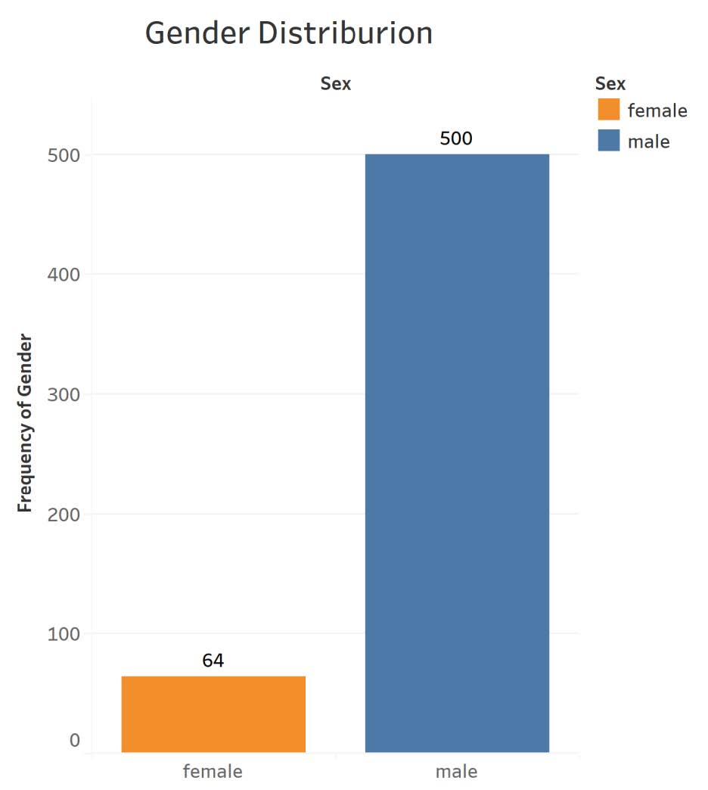

**Distribution of Gender** 
Let’s start with a simple visualization from the astronaut’s table. This visualization shows the distribution of male and female astronauts on space missions. We can see that only about 564 people ever been to space out of which most are men. That’s about 92% of humans travelled to space being men and the other 8% being women. The main reason for this is the availability of data. Initial requirements for astronauts in the 1960’s mandated military training for the crew. This led to men being on the very first training and simulation mission which skewed initial data towards men. Recently the mandates have changed, and the most recent studies suggest females as the best options as their bodies are more adaptable in space than men.

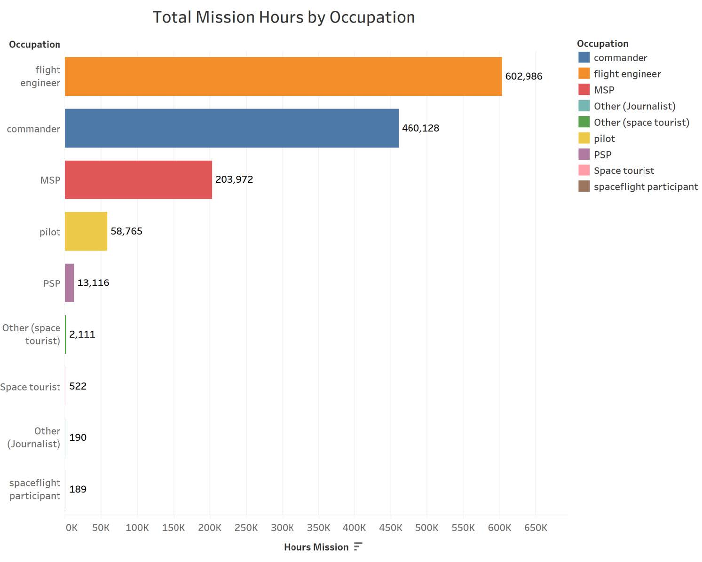

**Mission Hours by Occupation** 
This visualization shows the distribution of mission hours by occupation. We can see that flights engineers, commanders, and managed service providers (MSP) dominate the mission hours which is the number of hours an astronaut spends in a role either on the ground or in space. This is a cumulative value which means we are taking the sum of these occupations as there can be more than one person in these positions and each person can play multiple roles when one a mission. This answers one of the research questions about the role which astraunts spend most of their time in, which is The Flight Engineer.

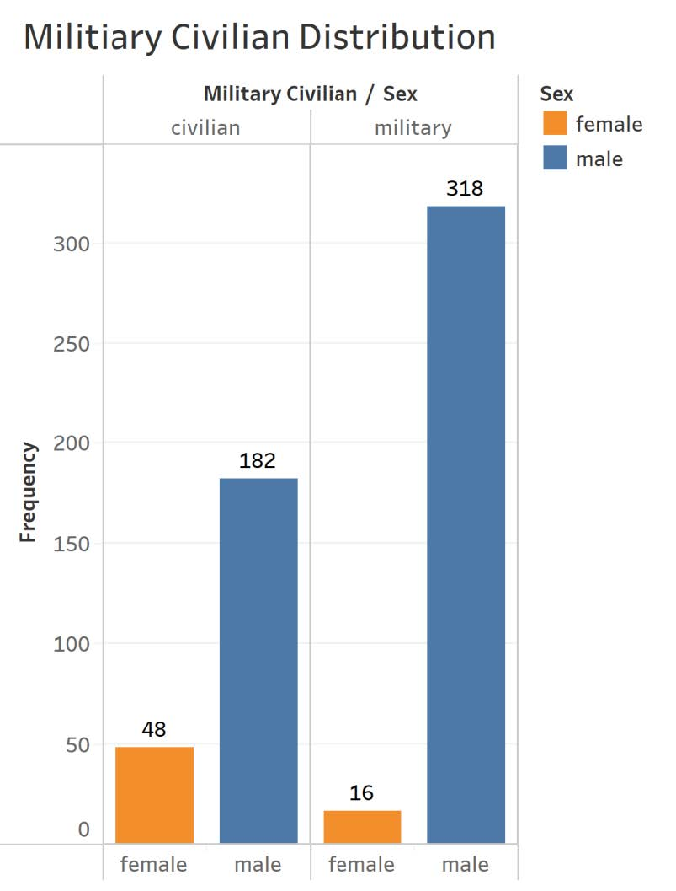

**Military Civilian Distribution** 
This visualization shows the distribution of astronauts from military or civilian backgrounds. We can see that most males are from military background. Interestingly, females from military background are lesser at 16 when compared to those from civilian background at 48. This could be due to the requirement of females for more scientific roles like a botanist, geologist etc.
This answers the research question where most of the Male astronauts are from The Military Background. while, most of the Female astronauts are from The Civilian Background.

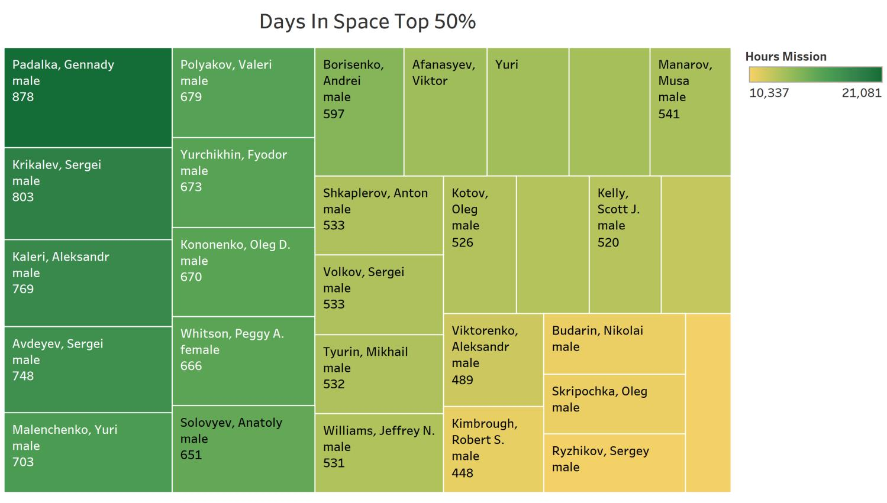

**Astronauts Top 50% Days in Space Distribution** 
The tree map above shows the top 50% astronauts in space. In total as we saw earlier, we have about 564 people that went to space and having all of them as block will make the visualization quite convoluted. So, I decided to show the top 50% in terms of the hours spent. From the visualization, Padalka Gennady has the highest days logged at 878 for males and in females the highest logged days in space is 666 by Whitson, Peggy A. We can also see that the blocks have very less variation in size which means the number of days to stay in space is decided by the mission control which gradually increases the time of stay to push the envelope for every flight. That’s a neat way to test human endurance and find ways to understand the adaptability of the human body.

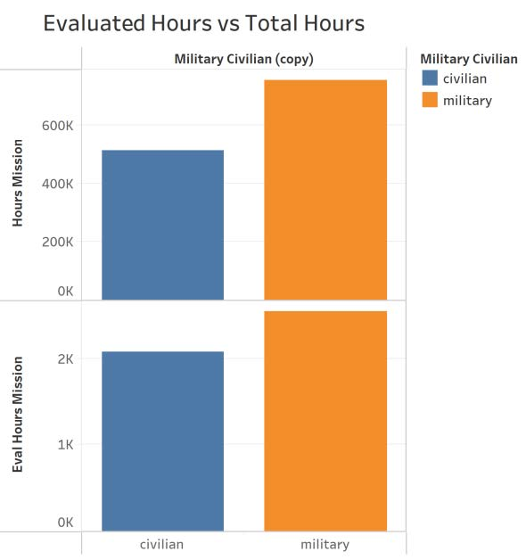 | 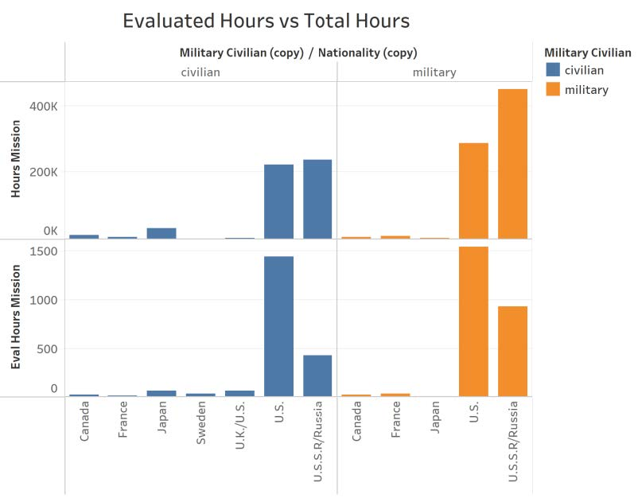

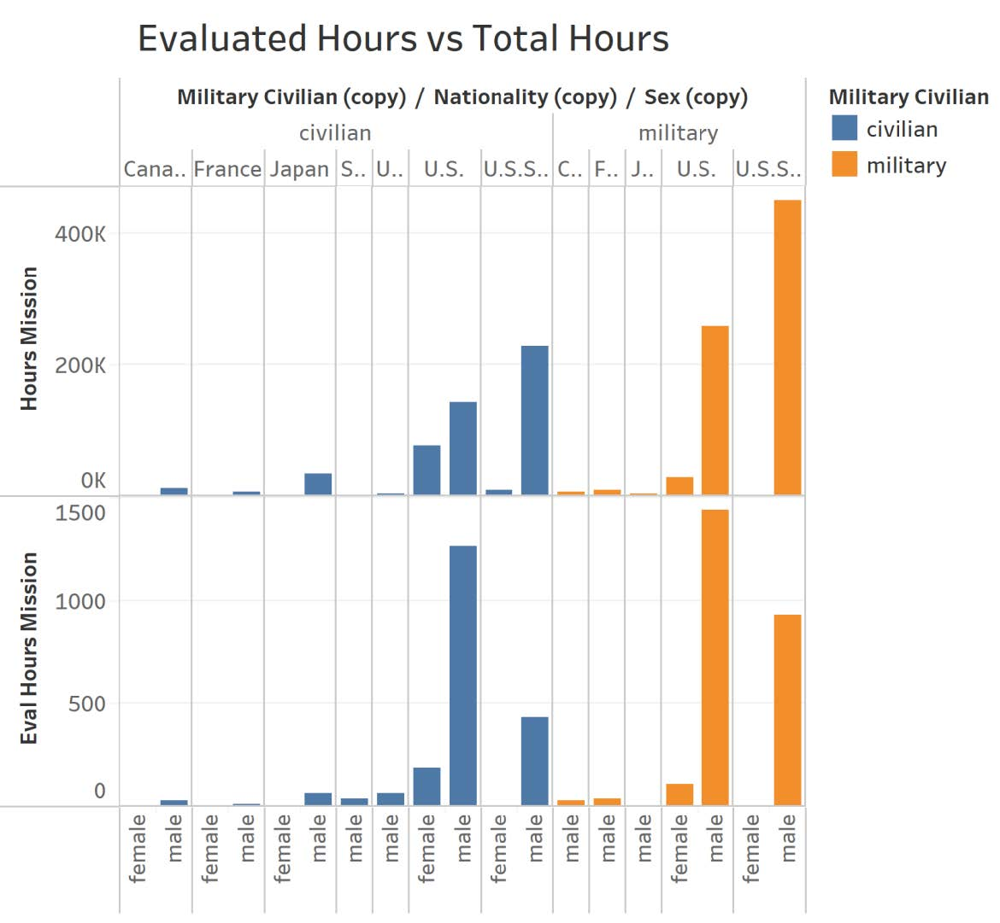

**Drill Down on Evaluated Hours vs Total Hours with Respect to Background, Nationality and Gender** 
The graphs above show the difference between total assessment hours and actual hours spent by astronauts, split down by the binary characteristic civilian/military, nationality, and gender. The distribution of training hours and hours spent on mission by astronauts from civilian and military background is depicted in the first plot. The overall number of hours spent on assessment and mission hours for military personnel is significant, with 2500 hours spent on evaluation and 700K hours spent on mission hours. For civilians, the assessment time is 2000 hours, and the mission time is 500K hours. This clearly demonstrates how much time military people spend in space and on the ground on projects.
From the plots we can clearly see astronauts from military background spend the most time and the same goes for their nationality, where most of them are from U.S. or U.S.S.R. We can also see from the drill down that most of the astronauts are males as well.
While most of the military personnel are from the Soviet Union, the United States has about similar numbers of astronauts from each department. Japan is next, with largely civilians, followed by the United Kingdom and the French. The ending narrative shows that the individuals are divided by gender, with nearly no females in the USSR and only a few members in the USA squad.

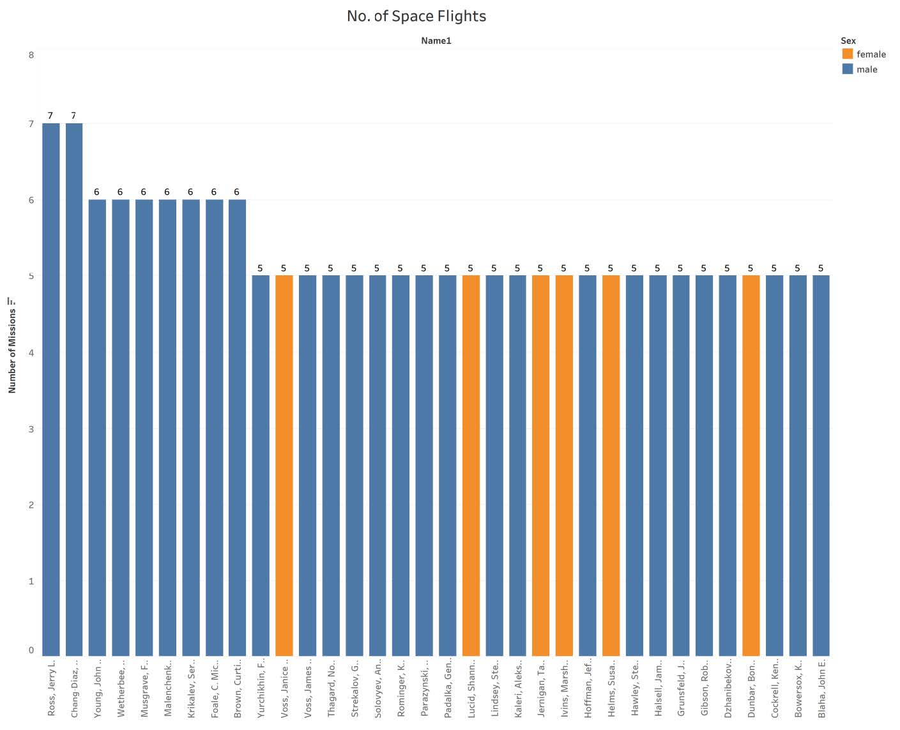

**Highest Number of Missions by a Single Astronaut** 
The number of astronomical excursions is an important measure of how much tolerance a human body can bear in the vacuum. On the X-axis is the name of the Astronomer, and on the Y-axis is the number of journeys they have taken throughout their lifetime, with the gender as the legend. So far, only two members, Jerry L Ross and Franklin R Chang-Diaz, have completed seven journeys, seven members have made six trips, and more than ten members have made five excursions. Females are the ones who make the most journeys, at 5.

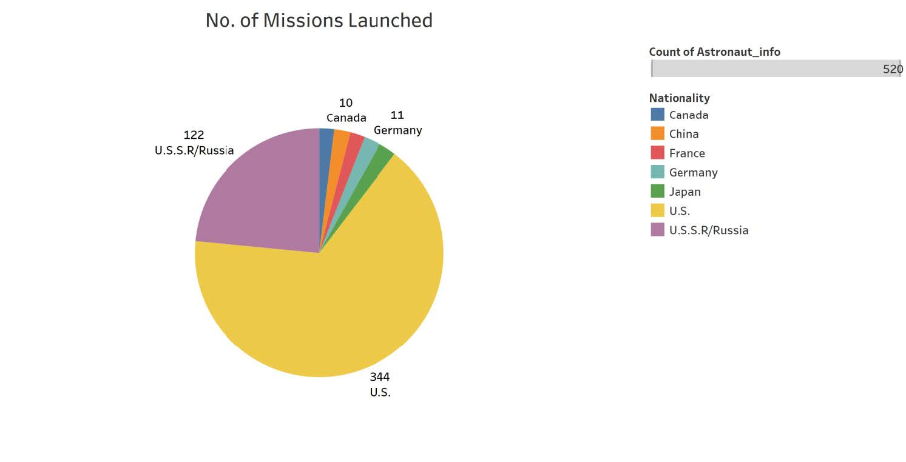

**Number of Missions Launched by Country** 
The number of missions launched by the top seven countries is depicted in the graph above. With 344 and 122 missions, respectively, the United States and Russia are the two most prominent countries. Japan has launched 12 missions, Germany has launched 11, and so forth. These achievements demonstrate that the United States and the Soviet Union are at the forefront of space exploration. These figures are only going to rise now that SpaceX has entered the picture.

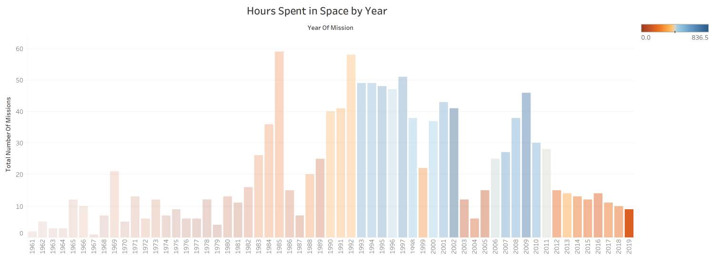

**Number of Hours Spent in Space by Year** 
The animation above depicts the number of missions completed and the total number of hours spent in each year since the space race began. As can be observed, the number of missions seems to follow a normal distribution. At the midpoint of practically every decade, there are a slew of initiatives planned, with 1984 being the year with the most: 58 missions. In 1967, the smallest number of missions was planned. As the year progresses, the quantity of missions clearly fluctuates.
An interesting observation is that the number of missions had reduced significantly from 2010, which might be due to the reduced funding to NASA. This turned the attention to the private companies like Space X, Blue Origin etc. which re-ignited the drive to invest more into space research and long-term sustainability of human civilization.

## Dashboards
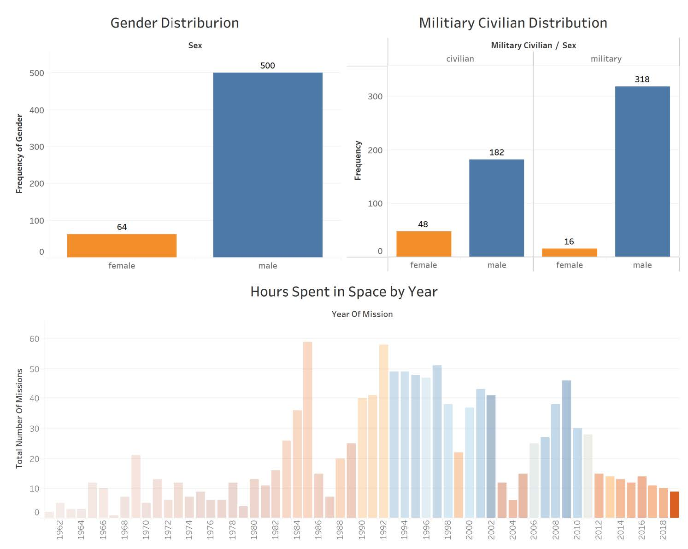

**Dashboard #1** 
This is the first dashboard that shows the mission statistics by gender and their background. It also shows the number of missions launched by year from 1962 to 2019. This dashboard gives a general sense of the mission frequency by year and astronaut split.

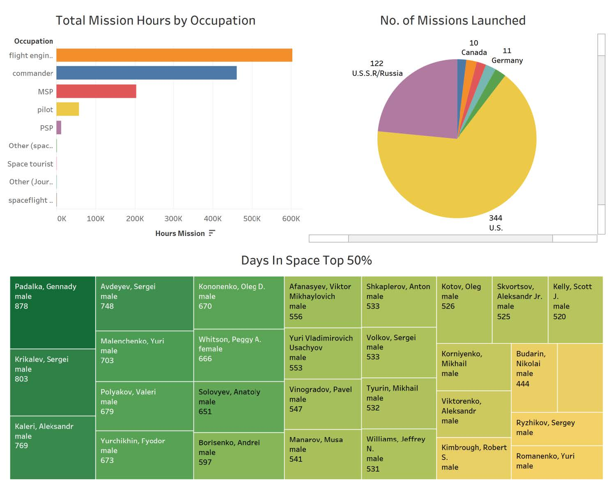

**Dashboard #2** 
This is the second dashboard that shows the time spent by astronauts in space and the missions launched by country. We also see the role of astronauts spent on mission. To summarize, this dashboard shows the mission specific metrics that give an overview of the effort put into each mission.

## Conclusion
Space exploration is still in its infancy even to this day. Although the first manned mission was in 1969, public enthusiasm has dwindled over the years which in turn led to lower funding from government. The United States military budget is over 600 billion whereas NASA’s budget last year was a little over 20 billion. But in recent years there has been a big push from entrepreneurs like Elon Musk and Jeff Bezos to commercialize the space industry. We are seeing space internet being a viable option with companies pouring billions into the research and development. Space mining is a Trillion-dollar industry which will drive human progress. But from our analysis we got a little glimpse into the background of the missions so far and delved deeper into the astronauts’ distributions which opens the door for more advanced analysis to understand the space industry better and suggest better solutions to the problems like building a Dyson Sphere, Space Engine etc. (Fascinating topics!) which will power human progress for eons to come. Thanks for giving this wonderful opportunity for me to explore the data in a way that helps everyone makes sense of the data and gain some interesting insights along the way.

## Learnings
I have worked with tableau before so this project was a fun one. I got a chance to brush up my tableau skills and get to build some insightful visualizations. In this project I have used 2D plots, calculated fields, animations, compound plots, dashboards and much more to tell a data driven story with very nice looking visualizations to convey the information and insights in the most consice way possible.